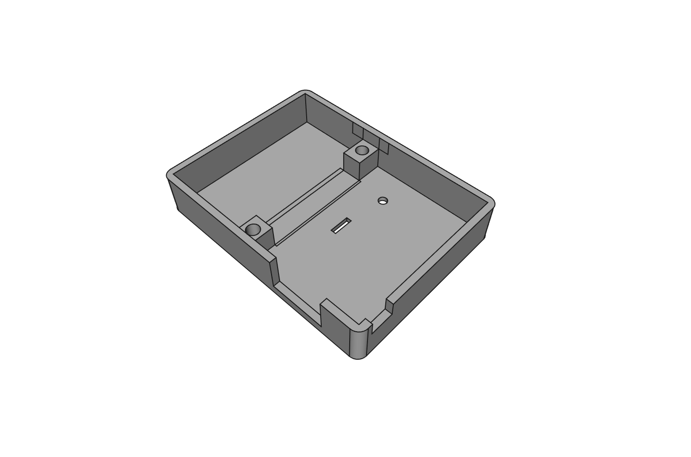
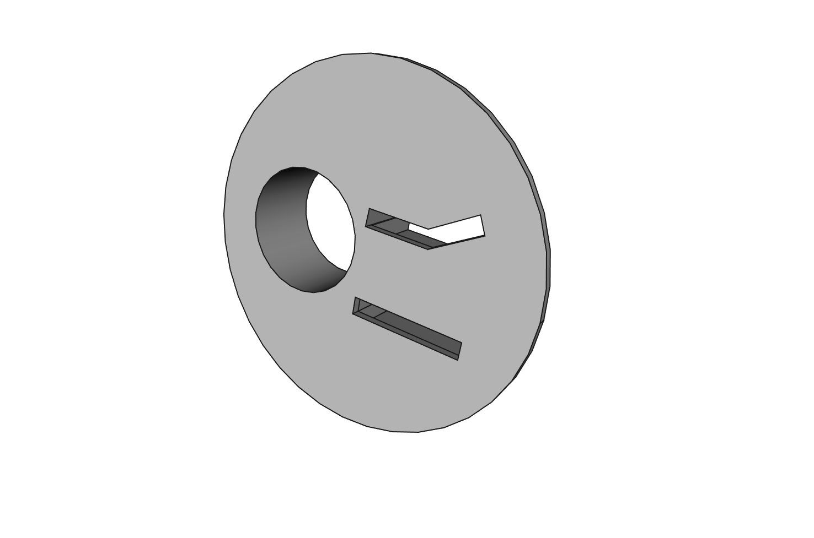

````
 __  __ __  __ ___  ___
|  \/  |  \/  | _ \/ __|
| |\/| | |\/| |   / (__
|_|  |_|_|  |_|_|_\\___| - 3dprint
````

Modern Model Railroad Control - Controlling your model railroad the modern way.

## Översikt
I detta repository samlas alla filer som handlar om 3D-utskrifter till MMRC.

I respektive undermapp finns diverse olika filer, minst en originalfil (FreeCad), en bild och en STL-fil som kan användas för att via en slicer-mjukvara skapa en utskriftsfil för en specifik 3D-skrivare.


## MMRC Multibox
I denna mapp ligger filer för att kunna skriva ut en låda för en kretskortsdator och ett anpassningskort. Dessutom finns filer för att kunna skriva ut en hållare till lådan samt en avlastning för en USB-kabel.




## MMRC Controlbox
Här ligger filer för att kunna skriva ut styrpaneler för höger- respektive vänsterväxel. Panelerna har plats för en försänkt tryckknapp och två lysdioder.


